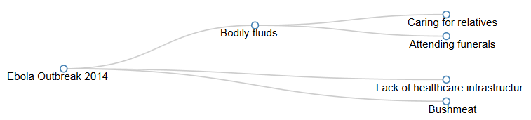

# ReFrame Project - Causal Analysis
## "Media in Context" Hackathon - Canvas - Al Jazeera - Doha, Qatar (29/11 to 01/12)

The ReFrame tool consists in a browser extension to be used when browsing news media website. The extension offers alternative versions of the story the user is currently viewing. Alternative stories are found according to two processes of curation:

1. Crowdsourced references (not covered here)
2. Causal analysis of news (this repo)

For this analysis, the Ebola outbreak (2014) was chosen as a case study. We used 20 news stories as text data, which was (human) coded for the factors causing Ebola. These causes, along with their subcauses, were inserted into a MySQL database. They were then plotted in a dendrogram (using d3.js).

The goal of this proof of concept is to show how this kind of causal analysis can be used to:
- understand how different news sources emphasize different causes for the same event;
- suggest alternative stories (causes) which are not currently being referred to by the story the user is currently reading.

 Shout outs to the ReFrame team: Faith Mzungu-Vilakati; Nyokabi Njuguna; Asha Siad; Tim Regan-Porter; Andres Colmenares.